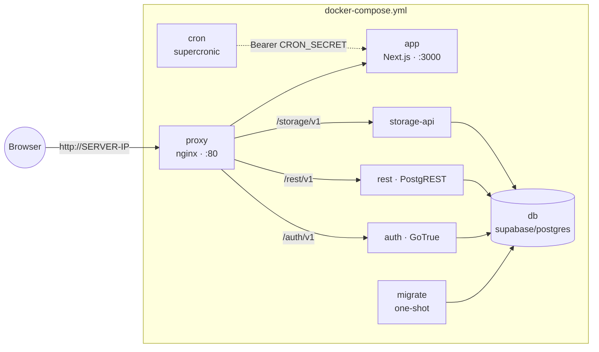

# Self-Hosting Firmabok

Everything runs on your own server, on your own network. The README's
two-command install is the normal path; this document is the reference
behind it.

## Architecture

One Compose file, [docker-compose.yml](../docker-compose.yml),
holds the whole stack:



Design choices worth knowing:

- **One origin, plain HTTP.** nginx routes the Supabase path prefixes
  to the right service and everything else to the app. No CORS, no
  certificates, no warnings: the stack is built for a private LAN and
  the app's cookies follow the URL scheme (`lib/auth/cookie-secure.ts`).
  If you front it with your own TLS proxy on an https:// address,
  Secure cookies switch back on by themselves.
- **No Kong, no studio, no pooler, no realtime.** The services enforce
  JWT auth themselves; administrate the database with `psql` through
  `docker exec`. The app polls for changes made outside the current
  tab instead of holding WebSocket subscriptions, which saves the
  heaviest idle service in the stack.
- **Migrations are a service.** The one-shot `migrate` container applies
  new files from `supabase/migrations/` on every `up`, records them in
  the `_firmabok.migrations` table, and the app is not allowed to start
  until it has finished. Updates can never outrun the schema.
- **Named volumes.** Database (`db_data`) and document archive
  (`storage_data`) live under Docker's management; nothing in the
  checkout is root-owned.

## Environment

`install-debian.sh` generates `.env` on first install. The variables:

| Variable | Meaning |
|---|---|
| `DOMAIN` | The server's LAN IP (or a local DNS name) |
| `POSTGRES_PASSWORD` | Database password for all service roles |
| `JWT_SECRET` | HS256 secret every service verifies tokens against |
| `ANON_KEY` / `SERVICE_ROLE_KEY` | Supabase-style JWTs signed with `JWT_SECRET` |
| `CRON_SECRET` | Bearer token the cron sidecar authenticates with |
| `AUTH_SIGNUPS_DISABLED` | `true` after the first account (`install-debian.sh lock`) |
| `IMAGE_TAG` | Optional: app image tag, defaults to `latest` |

## Updating

Re-run the install commands from the README (or `git pull` in the
checkout and run `./install-debian.sh <ip>` again): the script pulls
the newer app image, applies only the migrations that are new, and
restarts. Nothing else needs tending.

## Backups

The named volumes are not files to copy - back up logically:

```bash
docker exec firmabok-db-1 pg_dump -U postgres -d postgres | gzip > firmabok-$(date +%F).sql.gz
```

Ship that off-host on a schedule. As a portable, vendor-neutral layer
on top, export each fiscal year as SIE via the app (Rapporter → SIE):
any Swedish bookkeeping system can re-import it. Documents live in the
`storage_data` volume; include it if you want file-level copies:

```bash
docker run --rm -v firmabok_storage_data:/data -v "$PWD":/out alpine tar czf /out/firmabok-documents.tgz -C /data .
```

## Building from source

The published image is `ghcr.io/mews-se/firmabok`. To run your own
build instead:

```bash
docker build -t ghcr.io/mews-se/firmabok:local .
echo 'IMAGE_TAG=local' >> .env
./install-debian.sh <ip>
```

## Troubleshooting

**The health wait times out.** Look at the logs (from the checkout):
`docker compose logs migrate app`.
The usual causes are a migration error (migrate exits non-zero and the
app never starts) or wrong values in `.env`.

**Port 80 is taken.** Something else on the server owns it; stop it or
change the proxy's port mapping in the Compose file.

**Login loops back to the login page.** The app URL and the address in
the browser must match: `DOMAIN` decides both. Check that you are
browsing `http://<DOMAIN>` exactly.

**Signups are closed and I need another account.** Set
`AUTH_SIGNUPS_DISABLED=false` in `.env`, run `docker compose up -d`,
create the account, then run `./install-debian.sh lock` again.
